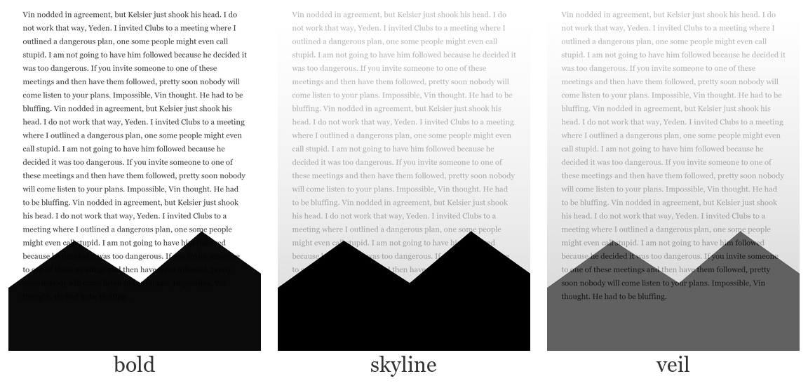

# koreader-screensavers

Turn your own photos into **transparent e-ink sleep-screen overlays** for
[KOReader](https://github.com/koreader/koreader). KOReader keeps the last book
page on screen and only paints the *opaque* pixels of your screensaver — so your
photo floats over the text, with the page showing through wherever the image is
transparent.

It's a tiny ImageMagick pipeline plus a no-dependency terminal UI. **No AI
service, no internet, no account** — the default styles are pure ImageMagick;
the optional `subject` cutout runs a *local* neural net. Everything works
offline.



## Why

E-ink screensavers are usually full, opaque images. The fun trick KOReader
allows is **"Leave screen unchanged"** as the sleep background: it doesn't blank
the page, so a partly-transparent PNG layers *over your book*. A silhouette
skyline, a faded sunset, a cut-out portrait — drifting over the last paragraph
you read.

## Styles

| style | what it does | best for |
|-------|--------------|----------|
| `bold` | bright areas (sky/snow) go transparent, dark = solid ink; text shows through. Top edge auto-fades. | landscapes, silhouettes |
| `skyline` | hybrid: dark foreground = solid ink, bright sky = soft veil | skyline shots, sunsets over land |
| `veil` | the whole photo as a soft semi-transparent overlay | big skies / sunsets you want to keep |
| `subject` | ML cutout of the subject, background transparent (local U2Net) | portraits, busy/dark backgrounds |
| `full` | opaque wallpaper, no transparency | when the scene *is* the whole picture |

E-ink is 16-level grayscale, so colour (e.g. sunset hues) is lost — only tone
survives. `veil` and `skyline` are the nicest compromise for colourful skies.

## Requirements

Just two things, on **Windows, macOS or Linux** alike:

- **[Python 3](https://python.org)** (3.8+) — runs the generator and the UI.
- **[ImageMagick 7](https://imagemagick.org)** (`magick` on your PATH) — does the
  image work.

That's everything for `bold`/`veil`/`skyline`/`full`. No bash, no WSL, no
internet, no account. The `subject` cutout additionally needs a one-time setup
(`setup_subject.sh`, or `setup_subject.bat` on Windows) that creates a local
`.venv` and downloads the ~176MB U2Net model.

## Usage

### Terminal UI (easiest)

```bash
python3 screensaver.py
```

Drag a photo into the window, pick a style, get an instant preview. The UI also
browses what you've made and shows the exact KOReader settings to use.

To launch by double-click instead of the command line: **`screensaver.command`**
on macOS, **`screensaver.bat`** on Windows.

### One-shot CLI

```bash
python generate.py PHOTO [style] [out_name]

python generate.py cliff.heic skyline cliff
```

With the optional knobs as environment variables:

```bash
# macOS / Linux
CONTRAST=max python generate.py trail.jpg bold
VEIL=70      python generate.py sunset.jpg veil
```
```bat
REM Windows
set CONTRAST=max && python generate.py trail.jpg bold
set VEIL=70      && python generate.py sunset.jpg veil
```

Outputs land in `screensavers/<name>.png` (copy to the device) and a
`previews/<name>_preview.png` showing it over mock book text.

Knobs: `CONTRAST=med|high|max` (bold), `VEIL=NN` opacity (veil/skyline),
`SKY=lo,hi` skyline handoff band. (`make_screensaver.sh` is a thin shell wrapper
around the same engine for mac/Linux muscle memory.)

## Putting them on your reader

1. Copy `screensavers/*.png` into `koreader/screensavers/` on the device.
2. KOReader ▸ ⚙ ▸ **Screen ▸ Sleep screen** ▸ set the wallpaper folder to that
   folder.
3. **Sleep screen ▸ "Border fill, rotation and fit" ▸ set Fill to "No fill"** —
   the key step. With no fill, KOReader doesn't repaint a background behind the
   wallpaper, so the last book page stays put and the text shows through the
   transparent areas.
4. Optional: "Random image" to rotate through them.

> The transparency trick only works with **"No fill"** — any other fill paints a
> solid background and you'll just see the opaque image on white.

Default geometry targets an older Paperwhite (**1072×1448**). Change `W`/`H` at
the top of `make_screensaver.sh` for other models.

## Platform notes

Fully cross-platform — the generator is pure Python driving ImageMagick, so
there's no bash dependency.

- **Windows**: install [Python](https://python.org) and
  [ImageMagick](https://imagemagick.org/script/download.php#windows) (tick "Add
  to PATH" in its installer), then run `python screensaver.py` or double-click
  `screensaver.bat`. No WSL needed.
- **macOS / Linux**: `python3 screensaver.py`. On Linux the preview falls back to
  DejaVu/Liberation serif fonts if Georgia isn't present.

## How `subject` works

`subject_mask.py` runs the U2Net model (the one
[rembg](https://github.com/danielgatis/rembg) uses) directly via `onnxruntime`,
producing a matte that becomes the alpha channel. No rembg package, no cloud.

## License

MIT — see [LICENSE](LICENSE).
